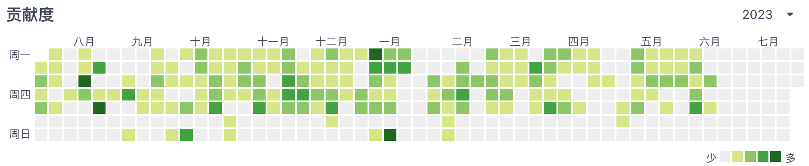
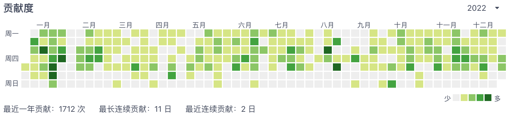
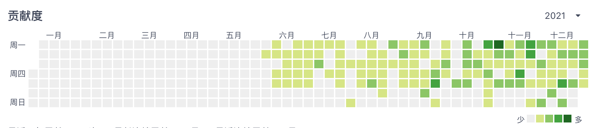

<h1>Hey! Welcome To My GitHub!</h1>

I am Eric, a Frontend developer from <b>China</b>, currently based in <b>Shanghai</b>.

I am actively seeking new job opportunities. If you are interested in my profile, please feel free to reach out to me. 📫 eric@ericchenart.com

<h3>Things I code with</h3>

  
  
  
  
  
  
  
  
  
  
  
  
  
  
  
  
  
  
  
  
  
  
  
  
  

<h3>My latest posts</h3>
<ul>
  <li>
    <a href="https://juejin.cn/post/7263363148954845239" target="_blank">
      <b>前端工程师也应该了解的 docker compose</b>
    </a>
  </li>
  <li>
    <a href="https://medium.com/@knight174/docker-what-frontend-engineers-should-know-1dabab623e41" target="_blank">
      <b>Docker: What Frontend Engineers Should Know</b>
    </a>
  </li>
  <li>
    <a href="https://juejin.cn/post/7250029395023544376" target="_blank">
      <b>前端工程师也应该了解的docker</b>
    </a>
  </li>
  <li>
    <a href="https://juejin.cn/post/7243342597001855033" target="_blank">
      <b>Ruby on Rails 快速入门</b>
    </a>
  </li>
  <li>
    <a href="https://juejin.cn/post/7238604003600138296" target="_blank">
      <b>浅谈 ChatGPT —— 现代巴别塔</b>
    </a>
  </li>
</ul>

<h3>Contributions calendar in <a href="https://gitee.com/hp-chenpc" target="_blank">Gitee</a></h3>

  
  
  

  Currently, the weather is: <b>28°C, feels like 32°C, <i>小雨</i></b>

<h3>Where to find me</h3>

------------

This <i>README</i> file is generated <b>every 1 hour</b>! Last refresh: 8月26日星期六 GMT+8 21:09

<!-- 

  
  
  

 -->
